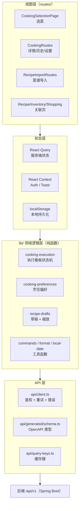
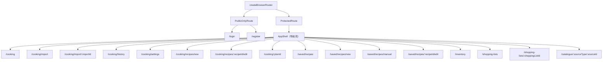
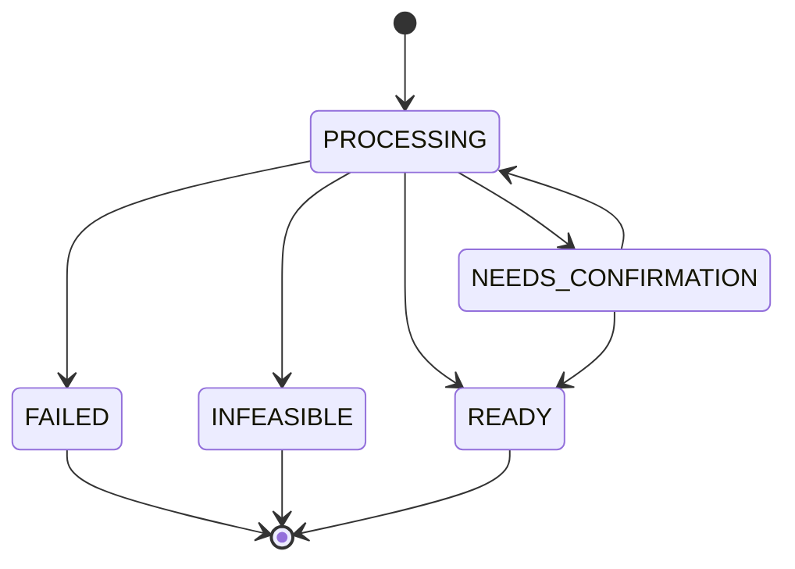
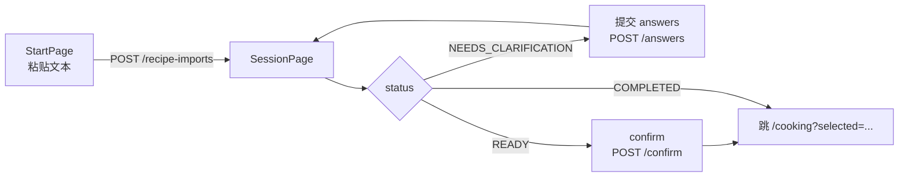
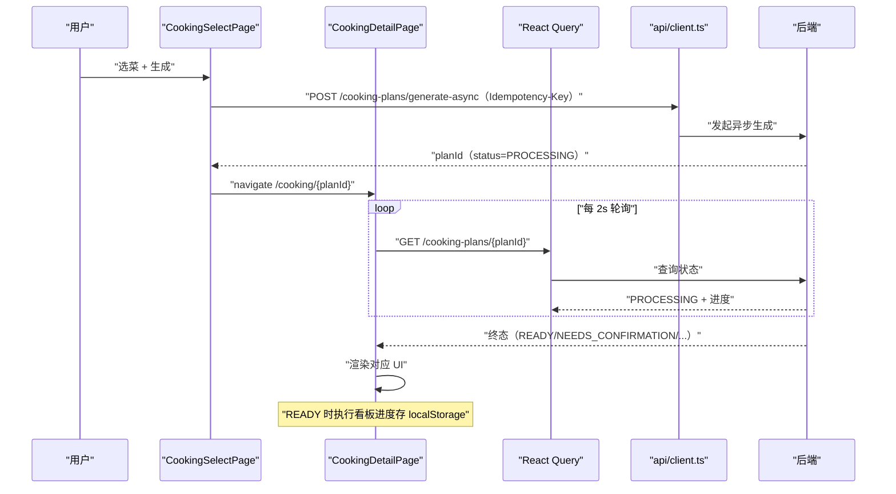
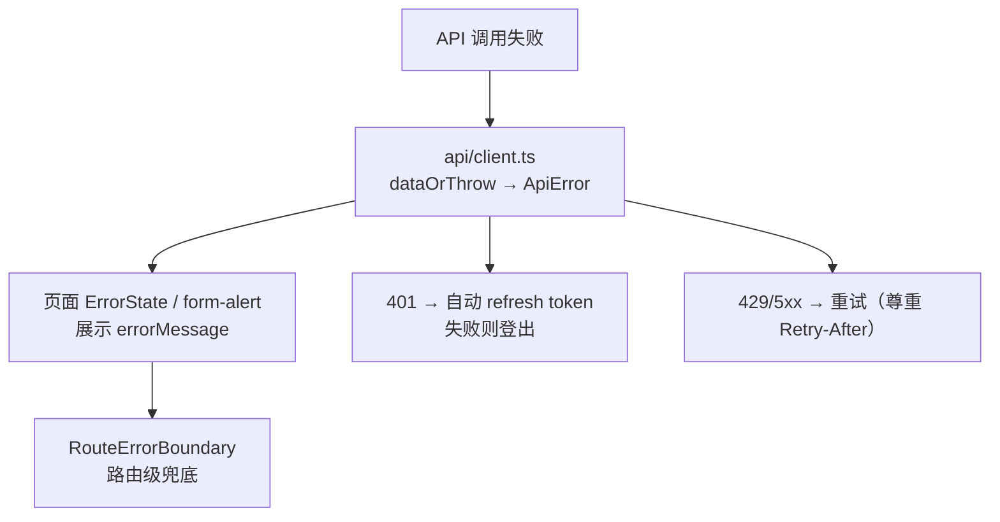

# FoodMind Web — Cooking 前端技术文档

> 本文档按「自顶向下」梳理 `foodmind-web` 中所有与 Cooking（烹饪计划）相关的前端页面：先讲架构与路由，再逐页拆解交互逻辑到源码行，最后给出接口对接、组件复用、异常处理与部署规范。
> 文件路径均相对于 `foodmind-web/`（下文简写为 `web/`）。

## 文档导读（怎么用这份文档）

这份文档按问题跳着查——汇报或排查时，按场景定位到对应章节。

### 速查路径

| 想知道什么 | 跳到哪 |
|---|---|
| Cooking 前端整体是什么、用什么技术 | §0、§1 |
| Cooking 有哪些页面、路由怎么配 | §2 |
| 某个页面具体怎么交互 | §3 |
| 数据怎么流转、状态怎么管 | §4 |
| 页面调了哪些后端接口、异常怎么处理 | §5 |
| 有哪些可复用组件/hooks/工具 | §6 |
| 出错了前端怎么兜底 | §7 |
| 响应式/可访问性/性能 | §8 |
| 怎么构建部署 | §9 |
| 找某个文件 | 附录 A |

### 完整目录

| 章节 | 内容 |
|---|---|
| §0 | 30 秒电梯陈述 |
| §1 | 顶层架构总览（技术栈 + 分层 + 设计理念） |
| §2 | 路由与页面层级（cooking 路由全景） |
| §3 | 核心页面逐页拆解（选菜/详情/历史/设置/导入/关联页） |
| §4 | 状态管理与数据流 |
| §5 | 接口对接规范（API 清单 + 参数 + 异常） |
| §6 | 可复用组件 / hooks / 工具函数 |
| §7 | 异常处理机制 |
| §8 | 响应式适配 / 可访问性 / 性能优化 |
| §9 | 部署流程 |
| 附录 A | 文件索引速查表 |

---

## 0. 30 秒电梯陈述（开场白）

Cooking 前端是 FoodMind 的「下厨模式」界面，负责把用户**选菜 → 生成排程 → 确认 → 执行**的完整流程跑通：

- 入口：`/cooking`（选菜页），用户挑菜谱、定份量和时间上限。
- 中台：调用后端 `/cooking-plans/generate-async` 异步生成，前端**轮询进度**并展示 6 阶段进度条。
- 结果：5 种终态（`PROCESSING` / `NEEDS_CONFIRMATION` / `INFEASIBLE` / `FAILED` / `READY`），每种都有专属 UI。
- 执行：`READY` 状态渲染一个**本地执行看板**（in-progress / available / blocked / completed 四泳道），进度存 localStorage。
- 技术栈：**React 19 + TypeScript + React Router 7 + TanStack React Query 5 + Tailwind 4**，API 层用 openapi-fetch 从后端 OpenAPI 契约生成强类型客户端。

---

## 1. 顶层架构总览

### 1.1 技术栈

| 类别 | 选型 | 版本 | 用途 |
|---|---|---|---|
| 语言/框架 | TypeScript + React | 5.9 / 19.2 | 视图与类型安全 |
| 构建 | Vite | 8.1 | 开发服务器 + 生产构建 |
| 路由 | react-router-dom | 7.18.2 | 声明式路由 + 懒加载 |
| 服务端状态 | @tanstack/react-query | 5.101 | 数据获取、缓存、重试、失效 |
| 表单 | react-hook-form + zod | 7 / 3.25 | 表单状态 + 校验 |
| 样式 | Tailwind CSS | 4.3 | 原子化样式 |
| 图标/图表/地图 | lucide-react / recharts / leaflet | — | UI 元素 |
| API 客户端 | openapi-fetch + openapi-typescript | 0.17 / 7.13 | 从 OpenAPI 生成强类型 client |
| 测试 | vitest + testing-library + msw + axe-core + playwright | — | 单测 / 可访问性 / e2e |
| Lint | oxlint | 1.71 | 静态检查 |

> 依赖清单见 [package.json](file:///Users/huangqijun/Documents/ADProject/foodmind-web/package.json#L27-L40)。

### 1.2 分层架构



### 1.3 设计理念（贯穿整个 cooking 前端）

| # | 理念 | 说明 | 源码锚点 |
|---|---|---|---|
| 1 | **服务端状态与本地状态分离** | 后端数据走 React Query，纯本地数据（执行进度/偏好/草稿）走 localStorage | `query-keys.ts`、`cooking-execution.ts` |
| 2 | **强类型贯穿** | 后端 OpenAPI 生成 schema，所有接口调用带类型 | `api/generated/schema.ts`、`Schema<'CookingPlanResponse'>` |
| 3 | **乐观并发（If-Match / Idempotency-Key）** | 写操作带版本号/幂等键，冲突返回 409 前端刷新 | `cooking-execution.ts`、各 mutation |
| 4 | **确定性回退与离线友好** | 执行看板本地模拟；离线时明确提示 | `cooking-execution.ts`、`client.ts` |
| 5 | **可访问性内建** | skip-link、aria-live、role、焦点管理 | `AppShell.tsx`、`States.tsx` |

---

## 2. 路由与页面层级

### 2.1 Cooking 相关路由全景

路由集中定义在 [router.tsx](file:///Users/huangqijun/Documents/ADProject/foodmind-web/src/app/router/router.tsx#L10-L66)，采用 `createBrowserRouter` + 懒加载。



### 2.2 页面清单

| 路由 | 页面组件 | 文件 | 说明 |
|---|---|---|---|
| `/cooking` | `CookingSelectPage` | `routes/CookingSelectionPage.tsx` | 选菜 + 份量 + 时间限制 + 生成 |
| `/cooking/:planId` | `CookingDetailPage` | `routes/CookingRoutes.tsx` | 计划详情（5 态 + 执行看板） |
| `/cooking/history` | `CookingHistoryPage` | `routes/CookingRoutes.tsx` | 计划历史 |
| `/cooking/settings` | `CookingSettingsPage` | `routes/CookingRoutes.tsx` | 烹饪偏好（region） |
| `/cooking/import` | `RecipeImportStartPage` | `routes/RecipeImportRoutes.tsx` | 菜谱导入入口 |
| `/cooking/import/:importId` | `RecipeImportSessionPage` | `routes/RecipeImportRoutes.tsx` | 导入会话（澄清/确认） |
| `/saved/recipes` | `RecipeLibraryPage` | `routes/RecipeRoutes.tsx` | 菜谱库 |
| `/saved/recipes/manual`、`/saved/recipes/:recipeId/edit` | `RecipeEditorPage` | `routes/RecipeRoutes.tsx` | 菜谱手动编辑 |
| `/inventory` | `InventoryPage` | `routes/InventoryRoutes.tsx` | 库存管理 |
| `/shopping-lists`、`/shopping-lists/:id` | 购物清单两页 | `routes/ShoppingRoutes.tsx` | 购物清单 |

> 导航入口：`AppShell` 顶部 `mode-switch` 提供「Eat out / Cook」切换，`/cooking` 是 Cook 模式首页（[AppShell.tsx L70](file:///Users/huangqijun/Documents/ADProject/foodmind-web/src/components/layout/AppShell.tsx#L70)）。

---

## 3. 核心页面逐页拆解

### 3.1 选菜页 `CookingSelectPage`

**作用**：Cook 模式首页，选菜谱 + 定份量/时间限制，触发异步生成计划。

**关键逻辑**（[CookingSelectionPage.tsx](file:///Users/huangqijun/Documents/ADProject/foodmind-web/src/routes/CookingSelectionPage.tsx#L40-L112)）：

| 关注点 | 实现 |
|---|---|
| 数据获取 | `useQuery` 拉 `/recipes`（菜谱列表）和 `/users/me/preferences`（饮食/过敏原） |
| 选中态 | `selectedIds: Set<string>`，从 URL `?selected=id1,id2` 恢复（L60-63） |
| 份量 | `servingsTouched` 区分「用户手动改」和「自动取已选菜最大份量」`suggestedServings`（L70-71） |
| 请求体 | `GenerateCookingPlanRequest` 含 `recipeIds/servings/maxMinutes/region/dietaryTagCodes/avoidAllergenCodes`（L72-79） |
| 幂等 | `prepareCommand` 生成 `Idempotency-Key`，相同 payload 复用同一 key（L89-92） |
| 生成 | `api.POST('/cooking-plans/generate-async')`，成功后跳 `/cooking/{planId}`（L80-88） |

**核心代码片段**：

```ts
// CookingSelectionPage.tsx — 生成计划（L80-93）
const generate = useMutation({
  mutationFn: async (input) => dataOrThrow(await api.POST('/cooking-plans/generate-async', {
    body: input.body, params: { header: { 'Idempotency-Key': input.key } },
  })),
  onSuccess: (plan) => {
    queryClient.setQueryData(queryKeys.cooking.detail(plan.planId), ...)
    navigate(`/cooking/${plan.planId}`)
  },
})
const submit = () => {
  command.current = prepareCommand(command.current, body)  // 相同 body 复用 key，避免重复提交
  generate.mutate({ body, key: command.current.key })
}
```

**口述话术**："选菜页就是 Cook 模式首页：选菜谱、定份数和时间上限，点生成时带一个幂等键，防止用户连点两次提交两个一样的计划。"

---

### 3.2 计划详情 `CookingDetailPage`（核心页面）

**作用**：`/cooking/:planId`，处理计划生成的**全部 5 种状态**，READY 时渲染执行看板。

**5 态路由**（[CookingRoutes.tsx L95-L252](file:///Users/huangqijun/Documents/ADProject/foodmind-web/src/routes/CookingRoutes.tsx#L95-L252)）：



| 状态 | 前端表现 | 关键逻辑 |
|---|---|---|
| `PROCESSING` | 6 阶段进度条 + 轮询 | `refetchInterval: 2000`（L103）；`/task` 拿进度（L106-112） |
| `FAILED` | 取消/错误提示 | 区分 `TASK_CANCELLED`（L199-207） |
| `INFEASIBLE` | 原因 + 安全替代 | `reasons`、`safeAlternatives`（L208-218） |
| `NEEDS_CONFIRMATION` | 确认表单 + 自动购物清单 | 策略题 + 剩余问题（L219-250） |
| `READY` | 执行看板 | `ReadyPlanBoard`（L254-320） |

**关键机制 1：进度阶段映射**（L32-41）。后端返回的 `node` 字段被映射到 6 个阶段，配合百分比 `[8, 30, 58, 74, 88, 97]`：

```ts
const PLAN_STAGES = [
  { label: 'Preparing recipes', nodes: ['assemble_request', 'validate_input'] },
  { label: 'Understanding recipes', nodes: ['parse_recipes', 'detect_gaps', ...] },
  { label: 'Safety & inventory', nodes: ['validate_safety', 'check_feasibility', ...] },
  { label: 'Preparation plan', nodes: ['merge_preparation', 'build_task_graph'] },
  { label: 'Cooking schedule', nodes: ['solve_schedule', 'verify_schedule', ...] },
  { label: 'Finalising', nodes: ['apply_confirmation', 'explain_schedule', ...] },
]
```

**关键机制 2：执行看板状态机**（`ReadyPlanBoard` L254-320，依赖 [cooking-execution.ts](file:///Users/huangqijun/Documents/ADProject/foodmind-web/src/lib/cooking-execution.ts#L164-L221)）：

```ts
// cooking-execution.ts — computeExecutionSnapshot（L164-198）
// 把 timeline 任务分成 available / inProgress / completed / blocked 四泳道
const depsDone = predecessors.every((prev) => states[prev.key] === 'COMPLETED')  // 依赖完成
const resourceFree = !inProgress.some((active) => sharesResource(active, entry.task))  // 资源空闲
if (!offered && depsDone && resourceFree) { available.push(entry.task); offered = true }
else { /* blocked，附原因 */ }

// applyExecutionUpdate（L200-221）—— 乐观并发
if (update.expectedEventId !== `evt-${eventId}`) throw new ExecutionConflictError()
```

**关键机制 3：执行进度持久化**（`cooking-execution.ts` L53-84）：进度以 `timelineKey + eventId + states` 存 localStorage，时间线变了（key 不匹配）就重置，保证换计划不串数据。

**口述话术**："详情页是状态机：生成中轮询进度，需要确认就弹表单，失败了给原因，可行了出执行看板。看板是纯前端本地模拟——后端还没有执行接口，所以依赖和资源冲突的判断、进度保存都在浏览器里做，将来换真接口只改这几个纯函数。"

---

### 3.3 历史页 `CookingHistoryPage`

**作用**：展示账号下已生成的所有计划（新→旧）。

**逻辑**（[CookingRoutes.tsx L346-L359](file:///Users/huangqijun/Documents/ADProject/foodmind-web/src/routes/CookingRoutes.tsx#L346-L359)）：`GET /cooking-plans/history`（page=0, size=20），渲染 `mini-card` 列表，点击跳 `/cooking/{planId}`。

---

### 3.4 设置页 `CookingSettingsPage`

**作用**：设置烹饪地区（region），影响后端安全政策（USDA/SFA）。

**逻辑**（[CookingRoutes.tsx L366-L383](file:///Users/huangqijun/Documents/ADProject/foodmind-web/src/routes/CookingRoutes.tsx#L366-L383)）：region 存在 localStorage（`cooking-preferences.ts`），可选 SG/US/CN，保存时 toast 提示。饮食/过敏原统一走 `/me/preferences`，这里只放 region。

---

### 3.5 菜谱导入 `RecipeImportStartPage` / `RecipeImportSessionPage`

**作用**：粘贴多语言菜谱文本，Agent 解析成结构化草稿，缺字段时逐项澄清，确认后保存。

**流程**（[RecipeImportRoutes.tsx](file:///Users/huangqijun/Documents/ADProject/foodmind-web/src/routes/RecipeImportRoutes.tsx#L30-L170)）：



| 关键点 | 实现 |
|---|---|
| 多菜切分提示 | "---"、Recipe 标题、Markdown 标题分隔（L69） |
| 乐观并发 | `If-Match: "{version}"` 防止旧会话覆盖（L107、L115） |
| 澄清表单 | 按 `draftId` 分组问题，`fieldPath === 'ingredients'/'steps'` 用 textarea（L168-170） |
| 确认后跳转 | 用 `createdRecipes` 的 id 拼 `?selected=` 直接进选菜页（L125-129） |

---

### 3.6 关联页面（简要）

| 页面 | 文件 | 与 cooking 的关系 |
|---|---|---|
| `RecipeLibraryPage` | `RecipeRoutes.tsx` | 菜谱库，卡片带「Cook」按钮跳 `/cooking?selected={id}`（L54） |
| `RecipeEditorPage` | `RecipeRoutes.tsx` | 手动录入菜谱，供 cooking 选择；强调「quantity-first」食材行（L155） |
| `InventoryPage` | `InventoryRoutes.tsx` | 库存管理，cooking 生成计划前会检查库存 |
| `ShoppingListIndex/DetailPage` | `ShoppingRoutes.tsx` | 购物清单，cooking 计划缺料时自动创建；完成后回跳 `/cooking/{planId}`（L41） |

---

## 4. 状态管理与数据流

### 4.1 状态分层

| 层 | 方案 | 存什么 | 生命周期 |
|---|---|---|---|
| 服务端状态 | TanStack React Query | 计划、菜谱、库存、购物清单 | 缓存 `staleTime: 30s`，自动重试 |
| 全局 UI 状态 | React Context | 认证（Auth）、Toast | 应用级 |
| 本地持久化 | localStorage | 执行进度、region 偏好、草稿 | 设备级 |
| 组件状态 | useState/useRef | 选中菜、表单、临时态 | 组件级 |

### 4.2 生成计划的完整数据流



### 4.3 React Query 缓存键

集中在 [query-keys.ts](file:///Users/huangqijun/Documents/ADProject/foodmind-web/src/lib/api/query-keys.ts#L40-L44)，cooking 相关：

```ts
cooking: {
  detail: (id) => ['cooking', id],
  history: () => ['cooking', 'history'],
  task: (id) => ['cooking', id, 'task'],
},
```

---

## 5. 接口对接规范

### 5.1 Cooking 核心接口清单

| 接口 | 方法 | 参数/请求体 | 用途 | 页面 |
|---|---|---|---|---|
| `/cooking-plans/generate-async` | POST | `GenerateCookingPlanRequest` + `Idempotency-Key` | 异步生成计划 | 选菜页 |
| `/cooking-plans/{planId}` | GET | path `planId` | 查询计划状态 | 详情页（轮询） |
| `/cooking-plans/{planId}/task` | GET | path `planId` | 后台任务进度 | 详情页 PROCESSING |
| `/cooking-plans/{planId}/cancel` | POST | path `planId` | 取消生成 | 详情页 |
| `/cooking-plans/{planId}/shopping-list` | POST | path `planId` | 缺料时创建购物清单 | 详情页 |
| `/cooking-plans/{planId}/decisions` | POST | `answers[]` + `Idempotency-Key` | 同步提交确认 | 详情页 |
| `/cooking-plans/{planId}/decisions-async` | POST | `answers[]` + `Idempotency-Key` | 异步提交确认 | 详情页 |
| `/cooking-plans/history` | GET | query `page/size` | 历史计划 | 历史页 |

### 5.2 关联接口

| 接口 | 方法 | 页面 |
|---|---|---|
| `/recipes` / `/recipes/{id}` | GET/POST/PUT/DELETE | 菜谱库/编辑器 |
| `/recipe-imports` / `/{id}` / `/answers` / `/confirm` | POST/GET/POST/POST | 菜谱导入 |
| `/inventory/lots` / `/{lotId}` | GET/POST/PUT/DELETE | 库存 |
| `/shopping-lists` / `/{id}` / `/complete` / `/items/{itemId}` | GET/POST/PATCH | 购物清单 |
| `/users/me/preferences` | GET | 饮食/过敏原 |

### 5.3 请求规范

| 机制 | 说明 | 源码 |
|---|---|---|
| 鉴权 | `Authorization: Bearer {accessToken}` + `credentials: include`（refresh cookie） | `client.ts` L92-93 |
| 关联 ID | 每请求自动加 `X-Correlation-ID: crypto.randomUUID()` | `client.ts` L91 |
| 乐观并发 | 写操作带 `If-Match: "{version}"`，冲突返回 409 | 各 mutation |
| 幂等 | 生成/决策/购物清单带 `Idempotency-Key` | `commands.ts` `prepareCommand` |
| 错误统一 | `dataOrThrow` 把非 2xx 转 `ApiError` | `client.ts` L161-173 |

---

## 6. 可复用组件 / hooks / 工具函数

### 6.1 通用组件

| 组件 | 文件 | 用途 |
|---|---|---|
| `LoadingState` / `EmptyState` / `ErrorState` / `FallbackBanner` | `components/feedback/States.tsx` | 四态占位（loading/空/错误/降级） |
| `ToastProvider` + `useToast` | `components/feedback/ToastProvider.tsx` | 全局 toast |
| `AppShell` | `components/layout/AppShell.tsx` | 导航壳 + 模式切换 + skip-link |
| `SavedSectionTabs` | `components/saved/SavedSectionTabs.tsx` | Saved 区标签 |

### 6.2 页面内私有组件

| 组件 | 定义位置 | 用途 |
|---|---|---|
| `RecipeCard` | `CookingSelectionPage.tsx` L15-38 | 选菜卡片 |
| `ExecutionLane` / `IngredientPullList` | `CookingRoutes.tsx` L322-340 | 执行看板泳道/配料清单 |
| `ImportDraftCard` / `QuestionGroup` | `RecipeImportRoutes.tsx` L164-170 | 导入草稿/问题组 |
| `InventoryLotCard` | `InventoryRoutes.tsx` L81-131 | 库存卡片 |
| `ShoppingItemEditor` | `ShoppingRoutes.tsx` L62-87 | 购物清单项 |

### 6.3 自定义 hooks

| hook | 文件 | 用途 |
|---|---|---|
| `useAuth` | `AuthProvider.tsx` L130-134 | 认证上下文 |
| `useToast` | `ToastProvider.tsx` L33-37 | toast |
| `useProgressClock` | `CookingRoutes.tsx` L69-81 | 生成进度计时（内部） |

### 6.4 工具函数（`lib/`）

| 函数 | 文件 | 用途 |
|---|---|---|
| `prepareCommand` | `commands.ts` | 生成幂等 key（相同 payload 复用） |
| `buildExecutionTimeline` / `computeExecutionSnapshot` / `applyExecutionUpdate` | `cooking-execution.ts` | 执行看板状态机 |
| `loadCookingPreferences` / `saveCookingPreferences` | `cooking-preferences.ts` | region 本地持久化 |
| `loadRecipeDrafts` / `saveRecipeDraft` / `scaledRecipeIngredients` | `recipe-drafts.ts` | 草稿 + 份量缩放 |
| `formatDateTime` / `formatMoney` / `sentenceCase` | `format.ts` | 格式化 |
| `localCalendarDate` / `localMonday` | `local-date.ts` | 本地日期（不转 UTC） |
| `isStaleChunkError` / `installChunkRecovery` | `chunk-recovery.ts` | 陈旧 chunk 检测与自动刷新 |

---

## 7. 异常处理机制

### 7.1 四层错误兜底



### 7.2 关键机制

| 机制 | 实现 | 源码 |
|---|---|---|
| 错误对象 | `ApiError`（status/code/traceId/fieldErrors/retryAfterMs） | `client.ts` L17-39 |
| 统一抛错 | `dataOrThrow` 非 2xx 抛 `ApiError` | `client.ts` L161-173 |
| 用户文案 | `errorMessage`：离线→字段错误→默认消息 | `client.ts` L179-183 |
| 401 自动续期 | `authenticatedFetch` 拦截 401，refresh 后重放 | `client.ts` L136-153 |
| 重试策略 | 离线/4xx 不重试，其余最多 2 次，尊重 `retryAfterMs` | `QueryProvider.tsx` L10-18 |
| 乐观并发冲突 | `ExecutionConflictError` → toast 提示刷新 | `cooking-execution.ts` L32-37、`CookingRoutes.tsx` L296-301 |
| 陈旧 chunk | `isStaleChunkError` → 自动 reload | `chunk-recovery.ts`、`RouteErrorBoundary` L7-21 |
| 离线提示 | `navigator.onLine` + 全局离线 banner | `AppShell.tsx` L66-84、`client.ts` L180 |

---

## 8. 响应式适配 / 可访问性 / 性能优化

### 8.1 响应式适配

| 方案 | 说明 |
|---|---|
| Tailwind 原子化 | 响应式断点内联在 className |
| 桌面/移动双导航 | `primaryNavigation`（侧栏）+ `mobileNavigation`（底部）+ `bottom-navigation` | `AppShell.tsx` L27-48 |
| 移动专属 FAB | `showMobileRecordAction` 控制在某些路径隐藏（含 cooking 路径） | `AppShell.tsx` L71 |

### 8.2 可访问性（a11y）

| 实践 | 源码 |
|---|---|
| skip-link 跳主内容 | `AppShell.tsx` L106 |
| `aria-label` / `sr-only` | 全局搜索、图标按钮 |
| `role="alert"/"status"/"progressbar"` | `States.tsx`、进度条 |
| `aria-busy` / `aria-live` | 生成进度卡（`CookingRoutes.tsx` L184） |
| `aria-pressed` | 选菜卡片、region 按钮 |
| 焦点管理 | 路由切换滚动置顶、错误后 focus 输入 |

> 可访问性由 `axe-core` / `vitest-axe` 在测试中校验。

### 8.3 性能优化

| 优化 | 实现 |
|---|---|
| 路由懒加载 | `lazy: async () => import(...)` 代码分割 | `router.tsx` |
| 缓存 | React Query `staleTime: 30s` + 精确 queryKey | `QueryProvider.tsx` |
| 图片懒加载 | `loading="lazy"` | `CookingSelectionPage.tsx` L24 |
| 记忆化 | `useMemo`/`useCallback` 减少重渲染 | 各页面 |
| 轮询优化 | `refetchInterval` 按状态条件触发（PROCESSING 才轮询） | `CookingRoutes.tsx` L103 |

---

## 9. 部署流程

### 9.1 构建命令

| 命令 | 作用 |
|---|---|
| `npm run dev` | 本地开发（Vite，代理 `/api/v1` 到后端） |
| `npm run build` | `tsc -b && vite build && build-sites && check-bundle` |
| `npm run validate` | 全量校验（api:check + coverage + lint + typecheck + test + build） |
| `npm run test:e2e` | Playwright e2e |

### 9.2 环境与代理

[package.json](file:///Users/huangqijun/Documents/ADProject/foodmind-web/package.json#L6-L23) 定义脚本；[vite.config.ts](file:///Users/huangqijun/Documents/ADProject/foodmind-web/vite.config.ts#L10-L18) 配置开发代理：

```ts
server: {
  proxy: { '/api/v1': { target: environment.FOODMIND_BACKEND_ORIGIN || 'http://localhost:8080', changeOrigin: true } }
}
```

### 9.3 部署目标

- **Vercel**：`vercel.json` 配置，`api/v1/[...path].js` 作为 API 转发（rewrite）。
- **Docker**：`Dockerfile` + `docker/nginx.conf`。
- **引擎**：Node `24.16.x`。

---

## 附录 A：文件索引速查表

| 功能域 | 核心文件 | 一句话 |
|---|---|---|
| 路由 | `src/app/router/router.tsx` | 全部路由 + 懒加载 |
| 选菜 | `src/routes/CookingSelectionPage.tsx` | 选菜 + 生成 |
| 计划详情/历史/设置 | `src/routes/CookingRoutes.tsx` | 5 态 + 执行看板 |
| 菜谱导入 | `src/routes/RecipeImportRoutes.tsx` | 粘贴解析 + 澄清 + 确认 |
| 菜谱库/编辑器 | `src/routes/RecipeRoutes.tsx` | 菜谱 CRUD |
| 库存 | `src/routes/InventoryRoutes.tsx` | 库存 CRUD |
| 购物清单 | `src/routes/ShoppingRoutes.tsx` | 清单 CRUD + 完成回跳 |
| API 客户端 | `src/lib/api/client.ts` | 鉴权 + 重试 + 错误 |
| API 类型 | `src/lib/api/generated/schema.ts` | OpenAPI 生成类型 |
| 缓存键 | `src/lib/api/query-keys.ts` | React Query keys |
| 执行看板 | `src/lib/cooking-execution.ts` | 执行状态机 + 本地持久化 |
| 偏好 | `src/lib/cooking-preferences.ts` | region 本地存储 |
| 草稿 | `src/lib/recipe-drafts.ts` | 草稿 + 缩放 |
| 工具 | `src/lib/commands.ts`、`format.ts`、`local-date.ts`、`chunk-recovery.ts` | 幂等/格式化/日期/陈旧 chunk |
| 状态 | `src/app/providers/*`（Query/Auth/App） | 服务端状态 + 认证 |
| 通用组件 | `src/components/feedback/*`、`layout/AppShell.tsx` | 四态 + toast + 导航壳 |
