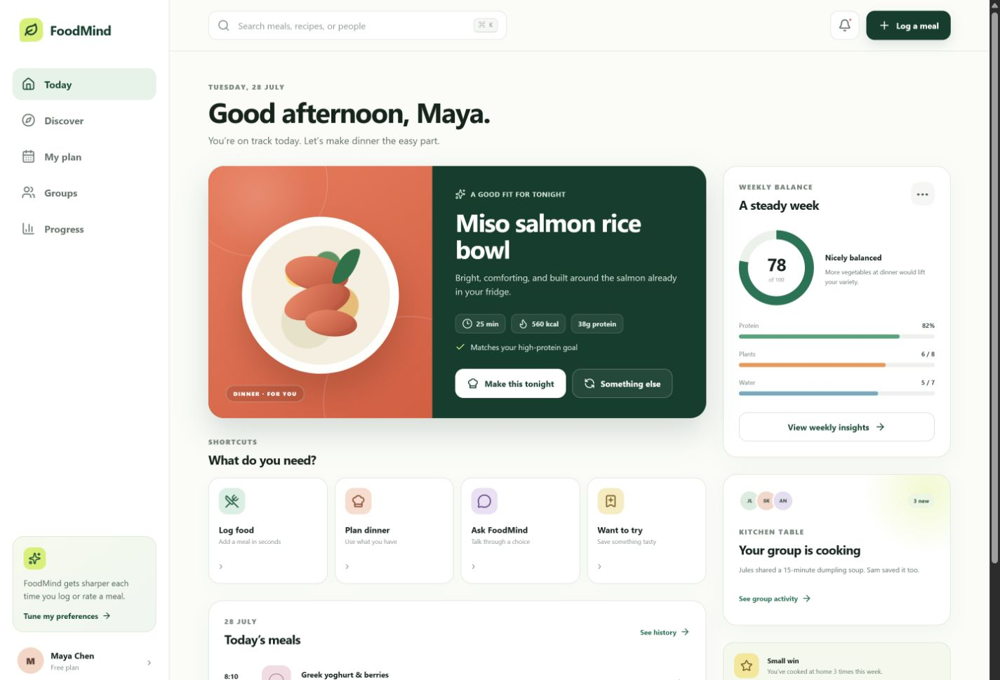
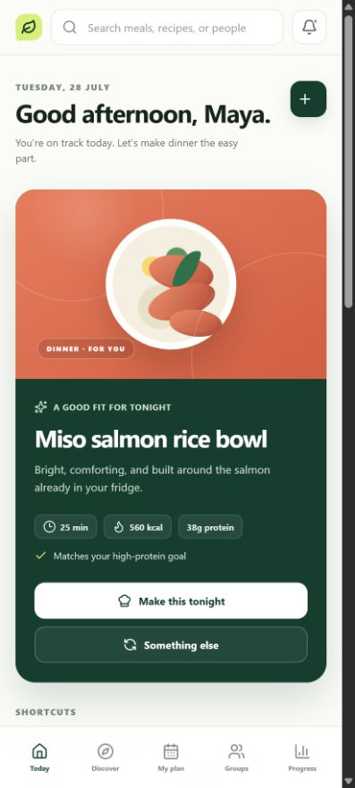
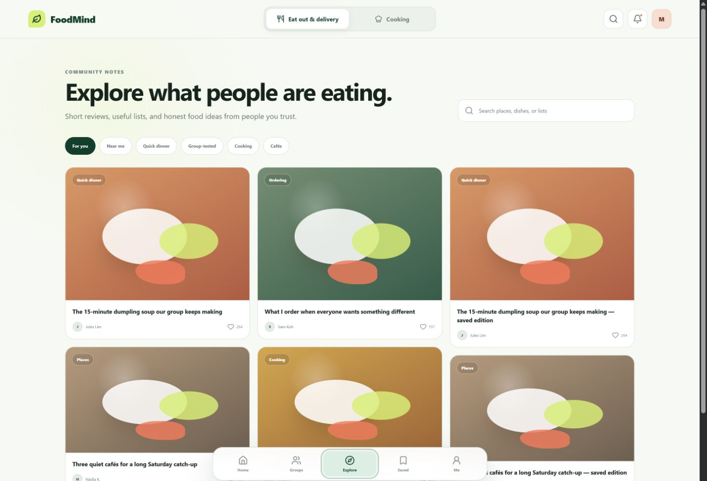

# FoodMind responsive UX

The home experience is organized around two clear modes: **Eat out & delivery**
and **Cooking**. Recommendation mode is the default and receives the strongest
visual priority; Cooking reuses the same interaction pattern to turn pantry
context into a practical meal plan.

## UX priorities

- Keep the mode switch visible at the top without competing with the main action.
- Make “Generate recommendation” the unmistakable first action on the home page.
- Explain how group preferences, personal history, budget, distance, and dietary
  needs influenced a result.
- Preserve the Proposal contract by receiving an ordered set of up to three
  distinct candidates while presenting one confident lead choice at a time.
- Treat Groups as a core shared decision space, including active votes and member
  signals.
- Give Explore a Xiaohongshu-inspired post grid for authorised group-visible
  restaurant finds and curated cooking ideas; it is not a public follower feed.
- Keep Home, Groups, Explore, Saved, and Me available from persistent labeled
  bottom navigation on desktop and mobile.
- Preserve responsive behavior, keyboard focus, accessible labels, and reduced
  motion support.

Automatic pantry capture, public internet restaurant search, ordering, and
payment remain outside the MVP.

## Preview

